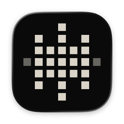
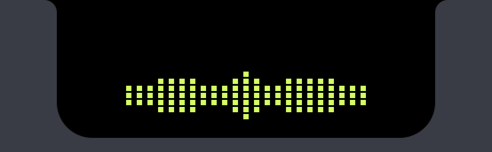
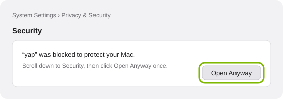

<p align="center">
  
</p>

<p align="center">
  <picture>
    <source media="(prefers-color-scheme: dark)" srcset="design/readme/wordmark-dark.png">
    
  </picture>
</p>

<h3 align="center">talk. it types.</h3>

<p align="center">
  Push-to-talk dictation and meeting notes for the Mac. On-device, open source.
</p>

> I talk faster than I type, and I didn't want my voice on someone else's
> server to fix that. So I built the dictation and notes tool I wanted: local,
> fast, and out of the way. — Willie

<p align="center">
  
</p>

## what it does

**Dictate.** Hold a key, talk, let go. The text lands where your cursor is.

- Transcribes while you talk, so a two-minute ramble pastes as fast as a
  two-second one.
- Auto-detects 25 European languages. No language picker.
- Style follows the app: casual in Slack, proper in Mail, identifiers intact
  in Xcode and Terminal.
- Your dictionary for names and product terms, and replacements.
- Never loses words: if it can't type in a field, the text is on your
  clipboard and in History for 30 days.

**Notes.** Record a meeting, get a clean note.

- Your mic and the call's audio as two tracks, so it knows "you" from "them",
  then splits them into speakers.
- Title, summary, decisions and action items, plus the full transcript.
- Plain Markdown files in a folder you choose. Works with Obsidian, iCloud, git.
- Notices calls in Zoom, Meet, Teams, Slack and FaceTime and offers
  *on a call? take notes*. No bot joins your meeting.

## private by design

Runs on your Mac. Nothing leaves it. Speech and language models run
on-device. The only network calls are the one-time model download and update
checks. No telemetry, no accounts, no API keys.

## install

Needs macOS 26 or later, an Apple silicon Mac and about 1 GB free for the
speech model.

**One line** (recommended). Files fetched with `curl` aren't quarantined, so
macOS doesn't interrupt:

```sh
curl -fsSL https://raw.githubusercontent.com/Bjoernbom/yap/main/scripts/install.sh | sh
```

It finds the newest yap 1.x release, checks its SHA-256, moves yap to
`/Applications` and opens it. The script is short;
[read it first](scripts/install.sh) if you like.

**Homebrew:**

```sh
brew install --cask bjoernbom/tap/yap
```

**DMG:** download it from [Releases](https://github.com/Bjoernbom/yap/releases)
and drag yap to Applications. yap isn't notarized, so the first launch is
blocked once. Open System Settings → Privacy & Security, scroll to Security
and click **Open Anyway**:



After that, yap updates itself.

## using it

| Do this                   | To                                         |
| ------------------------- | ------------------------------------------ |
| Hold **fn**, talk, let go | Dictate. Right ⌥ works too (Settings)      |
| Double-tap **fn**         | Go hands-free. Tap once to stop            |
| **Esc**                   | Cancel. Nothing is typed                   |
| **⌃⌘V**                   | Paste the last dictation again             |
| **⌥⌘N**                   | Start or stop notes                        |

Setup takes a minute: Microphone and Accessibility, pick your key, try it.
yap asks for system audio the first time you take notes.

Polish (opt-in, smooths false starts and grammar) and meeting summaries use
Apple Intelligence. Without it, dictation works the same and notes still get
the full transcript. If you can't turn Apple Intelligence on, set Siri's
language to one it supports in System Settings → Apple Intelligence & Siri.

## how it works

```
hold key ─▶ mic ─▶ cut at pauses ─▶ Parakeet on the Neural Engine, chunk by chunk
let go   ─▶ last chunk ─▶ cleanup + dictionary ─▶ polish (opt-in) ─▶ history ─▶ your app
```

A small native Swift and SwiftUI app. Speech is
[FluidAudio](https://github.com/FluidInference/FluidAudio) (Parakeet TDT v3,
VAD, diarization) on the Neural Engine; polish and summaries are Apple
Foundation Models; updates are [Sparkle](https://sparkle-project.org). The
full plan is in [docs/PLAN.md](docs/PLAN.md).

## build from source

Needs Xcode 26 and [XcodeGen](https://github.com/yonaskolb/XcodeGen)
(`brew install xcodegen`).

```sh
swift test   # the core logic (YapKit)
make app     # Debug build of yap.app into build/
make run     # build, quit any running yap, launch it
```

Releases are cut as described in [docs/RELEASING.md](docs/RELEASING.md).
Looking for the old Tauri app? yap 0.4 lives under the
[`v0.4.0`](https://github.com/Bjoernbom/yap/tree/v0.4.0) tag.

## license

[MIT](LICENSE). Pixelify Sans is under the [OFL](App/Resources/Fonts/OFL.txt).

made by [bjornbom](https://github.com/Bjoernbom).
